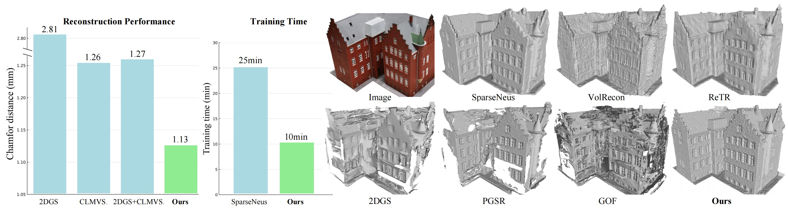
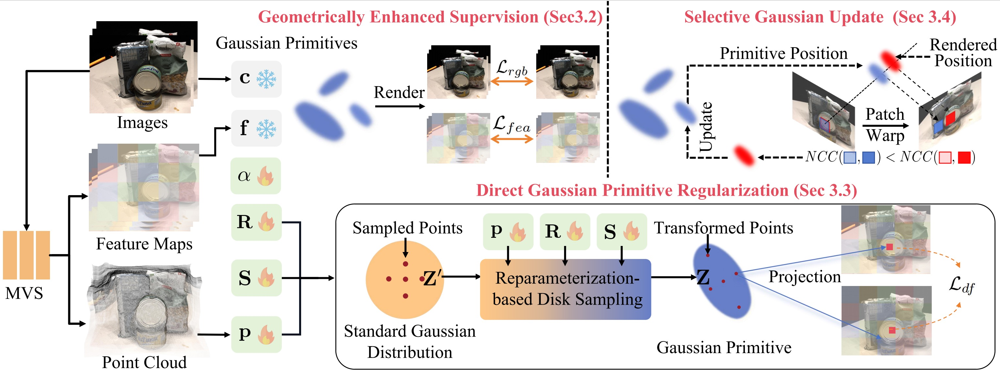

<div align="center">
<h1>Sparse2DGS: Geometry-Prioritized Gaussian Splatting for Surface Reconstruction from Sparse Views</h1>

[**Jiang Wu**]() · [**Rui Li**](https://ruili3.github.io/) · [**Yu Zhu**]() · [**Rong Guo**]() · [**Jinqiu Sun**]() · [**Yanning Zhang**]()

Northwestern Polytechnical University 

**CVPR 2025**

<a href='https://arxiv.org/abs/2504.20378'></a>
</div>


## ☁ Introduction
This paper proposes Sparse2DGS, a Gaussian Splatting method tailored for surface reconstruction from sparse input views. Traditional methods relying on dense views and SfM points struggle under sparse-view conditions. While learning-based MVS methods can produce dense 3D points, directly combining them with Gaussian Splatting results in suboptimal performance due to the ill-posed nature of the geometry. Sparse2DGS addresses this by introducing geometry-prioritized enhancement schemes to enable robust geometric learning even in challenging sparse settings.



## ⛏ Installation
```
conda create -n sparse2dgs python=3.8 # use python 3.8
conda activate sparse2dgs
pip install -r requirements.txt
```

We perform feature splatting by simply adjusting the number of rendering channels in the original “[diff_surfel_rasterization](https://github.com/hbb1/diff-surfel-rasterization/tree/e0ed0207b3e0669960cfad70852200a4a5847f61)”.
```
python -m pip install setuptools==69.5.1
pip install submodules/diff-surfel-rasterization
pip install submodules/simple-knn
```


## ⏳ Sparse View Reconstruction on DTU Dataset
### ⚽️ Running Step
* First down our preprocessed [DTU dataset](https://drive.google.com/file/d/1oaIMjZGCQhBO88ZSTKHGDPLwi2vLS_Xk/view?usp=drive_link).

```
dtu_sp
 ├── scan
 │     ├── images
 │     ├── sparse
 │     └── cam_0023.txt
 |     └── ...
 ...
```

We use the unsupervised [CLMVSNet](https://github.com/KaiqiangXiong/CL-MVSNet) to provide MVS priors. Before running, you need download the [pre-trained weights](https://drive.google.com/file/d/1y-21yh3aa18g7ORPzABR8LOOpYERmTTz/view?usp=drive_link) and set the dataset and weight paths in MVS/config.yaml.


* Set the dtu_path in scripts/train_all.py, and run the script to train the model on multiple GPUs.

```
python ./scripts/train_all.py
```

* Use the following command to render the mesh of each scene:

```
python ./scripts/render_all.py
```

### 💻 Evaluation
For evaluation, first download the [DTU ground truth](http://roboimagedata.compute.dtu.dk/?page_id=36), which includes the reference point clouds, and the [2DGS data](https://drive.google.com/drive/folders/1SJFgt8qhQomHX55Q4xSvYE2C6-8tFll9), which contains scene masks and transformation matrices. Then set the corresponding paths in scripts/eval_dtu.py.


```
python ./scripts/eval_dtu.py --skip_training --skip_rendering
```


## 📰 Citation
 
Please cite our paper if you use the code in this repository:
```
@article{wu2025sparse2dgs,
  title={Sparse2DGS: Geometry-Prioritized Gaussian Splatting for Surface Reconstruction from Sparse Views},
  author={Wu, Jiang and Li, Rui and Zhu, Yu and Guo, Rong and Sun, Jinqiu and Zhang, Yanning},
  journal={arXiv preprint arXiv:2504.20378},
  year={2025}
}
```

## 📨 Acknowledgments
This code is based on [2DGS](https://github.com/hbb1/2d-gaussian-splatting) and [CLMVSNet](https://github.com/KaiqiangXiong/CL-MVSNet), and we sincerely thank the authors‘ contributions.